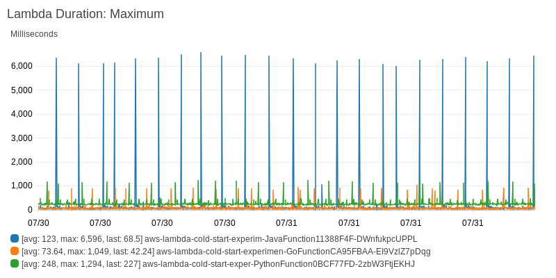
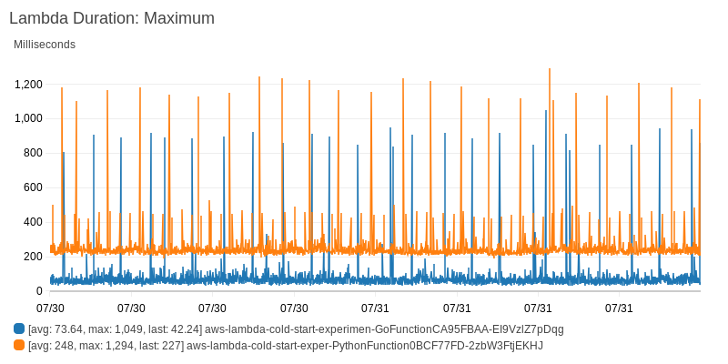

# AWS Lambda Cold Start Experiment

The goal of this project was to test cold start times of different languages in AWS Lambda.

Currently there's lambda for Java, Go, and Python.

Since I wanted this to be at least sort of realistic and not just have each one print 'Hello, World!', each Lambda is a trigger for an SQS queue that's subscribed to an SNS topic.
Each lambdas push a message to the SNS topic for another langague.
They're configured in an loop so once started they won't stop sending messages to one another until stopped.

This project was created with [projen](https://github.com/projen/projen). I maybe could have used it to create subprojects for each lambda folder but that seemed overkill. Gradle made the Java poject and `go mod init` for Go. Python is just one file.

## Results

